# Temporizador con desconexion y salia a TRIAC para 220v
**(error de aproximadamente 0.14 segundos de adelanto por hora temporizada)**

## Funcionalidades
    Presenta un menu al iniciar en el que podemos elegir entre dos modos:
    1) TIMER con tiempo a desconexion que muestra la cuenta atras hasta terminar la tarea 
       mas una barra de progreso que tambien va disminuyendo su longitud conforme se agota el tiempo.
    1a) Disponible una sonda de temperatura en funcion de cuya medida se puede controlar la salida
	1b) Si se activa el uso de la sonda, se puede establecer una temperatura de precalentamiento 
	que debe alcanzarse antes de comenzar a temporizar.
	
    2) RELOJ, modo en que se matiene activa la salida y muestra el tiempo que lleva en marcha.
       posibilidad de pausar o parar la actividad (solo en modo reloj)

	
**Montaje final**

   

Como siempre, cosas que surgen de la necesidad.
El antecedente, un temporizador electromecanico para enchufe que brillaba por su falta de exactitud.
Atraso de unos 25 minutos por hora programada.

La temporizacion la realizaba un pequeño reloj alimentado a 30v mediante un divisor de tension (y de una calidad pesima a tenor de su imprecision),
y la salida estaba controlada por un interruptor que era accionado mecanicamente durante el giro del reloj.

Ya disponia de una version de temporizador controlada con Arduino y salida a rele, sin RTC, montada reaprovechando la caja de un viejo router.
A pesar de no tener RTC contaba con una precision aceptable, aproximadamente un adelando de 1,5 segundos por hora. Dicha temporizacion estaba basada en el Timer2 de arduino y necesitaba de un contador de apoyo. Se descartó timer1 (16 bits) que hubiese sido mas conveniente, debido a que era un un montaje multiproposito y diponia de algunas salidas para servos, por lo que se optó por "respetar" a Timer1 que es en el que se basa la libreria servo.

**Test del temperizador original (izq) y Ajsutes de Timer1 (der)**

  

En este caso, y debido a que se va a destinar exclusivamente a ser un temporizador, se usa Timer1 que al ser de 16 bits permite sobradamente realizar el conteo necesario de una sola vez y evita tener que disponer de un contador secundario como el caso de Timer2 (Ademas facilita mucho los ajustes de temporizacion).
Esta nueva version de temporizador software basado en Timer1 consigue un error de aprox. 0.14 segundos de adelanto por hora temporizada.

Así que disponer de este temporizador electromecanico, inutil a todas luces, era una oportunidad de oro para canibalizarlo y crear de un temporizador mendianamente preciso y con una aspecto fisico compacto y nada aparatoso. (¿mejorable?, por supuesto).

Debido al limitado espacio disponible, se sustituye el arduino UNO de la version original por un NANO.
La salida a rele pasa a ser sustituida con TRIAC y optoacoplador. El LCD 16x2 se sustituye por una pequeña pantalla OLED de 128x64 pixeles, que la verdad sea dicha, nos permite una mayor cantidad de informacion. Eso sí, tambien es comunicacion I2C y hay que tener en cuenta que su escritura y refresco necesita algo mas de 40 ms (una autentica eternidad). Debemos colocar tambien en su interior la fuente de alimentacion para Arduino NANO, en este caso reaprovechando un viejo cargador de movil.

**vista del interior**

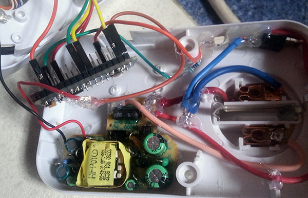

**Probando menus y aspecto visual**

  

En la imagen de la izquierda, programando tiempos. 
Imagen derecha, temporizador en modo ejecucion, mostrando temporizacion y barra de progreso de tarea.

## Lista de materiales

- 1x Arduino NANO
- 1x Fuente alimentacion AC 220v - DC 5v (un viejo cargador de movil)
- 1x optoacoplador MOC3041 
- 1x TRIAC BT137
- 1x resistencia 470 Ohm
- 1x resistencia 510 Ohm
- 1x resistencia 1 K
- 1x resistencia 1 M (o mayor)
- 1x led rojo (reusado el original del temporizador canibalizado)
- 1x pantalla OLED 128x64
- cables, soldador...

Para la sonda NTC
- 1x NTC 10 K
- 1x resistencia 10 K

## Esquema de montaje

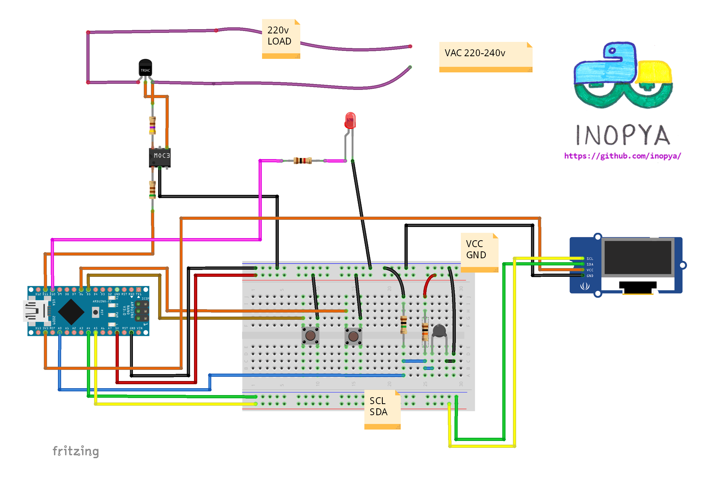

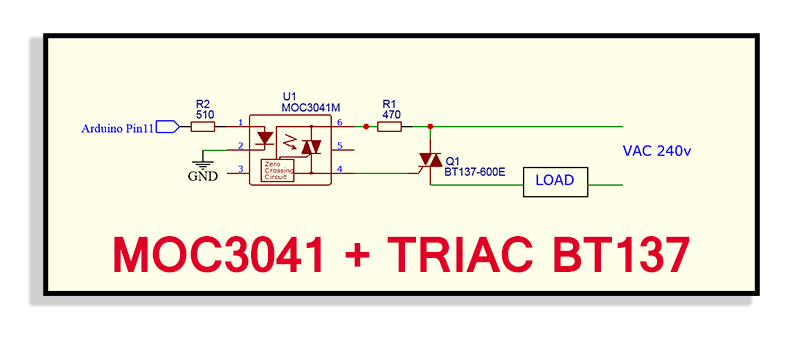

**IMAGENES PIEZAS 3D:**
Partes creadas para adaptar el temposizador original a sus nuevas funcionalidades

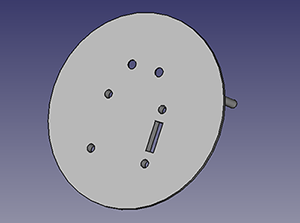  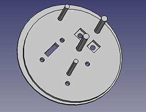
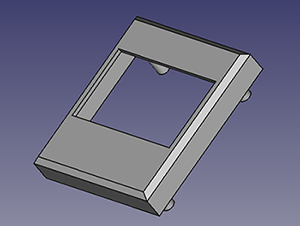  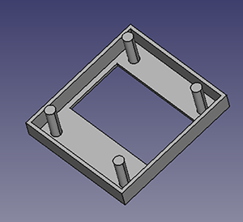
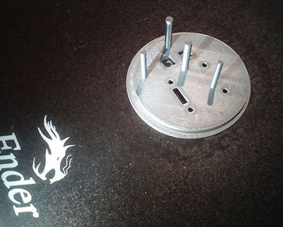  

**IMAGENES MENUS:**
Algunas imagenes del aspecto de los menus

  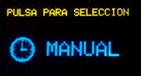
  
  
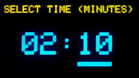  
    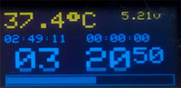

**NOTA1:**
Durante su funcionamiento el temporizador muestra en pantalla el voltaje de alimentacion de Arduino.
Es un detalle heredado de la version original multiproposito que dispone de la opcion de funcionar con bateria interna y en el que conocer el estado de esta es de interes.
Dado que no supone un problema ni de memoria ni de rendimiento (ni siquiera de hardware extra), se ha conservado dicha funcionalidad.
Así mismo se puede apreciar en algunas fotos que el voltaje que muestra es muy proximo a 5 voltios (en las pruebas mientras arduino esta conectado por USB al ordenador) y en cambio en el montaje final la alimentacion que se muestra ronda los 4.10v. Esto es debido a que es la tension que se consigue con el viejo cargador de movil utilizado.
En cualquier caso no supone ningun problema para Arduino el hecho de funcionar por debajo de los 5 voltios

**NOTA2:**
Puede haber pequeñas diferencias entre las imagenes mostradas y el aspecto visual de los menus que genera el firmware de este repositorio, debido a que dichas fotografias fueron tomadas durante el proceso de montaje hardware y ajuste del software. 
(Queda pendiente actulizar algunas de ellas)

